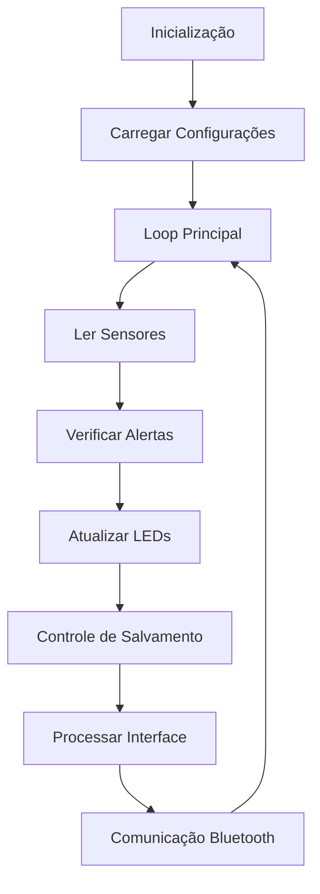

# Glitter Computer - Sistema de Monitoramento Embarcado

## Visão Geral
O Glitter Computer é um sistema embarcado para monitoramento ambiental desenvolvido para o controle de estufas, ambientes internos e sistemas de automação residencial. O projeto integra múltiplos sensores, atuadores e interfaces de comunicação para fornecer monitoramento em tempo real, registro de dados e alertas personalizáveis.

## Características Principais
- **Monitoramento Contínuo**: Temperatura, umidade e luminosidade em tempo real
- **Modos de Operação**: 4 modos predefinidos (Desativado, Noturno, Estufa, Ambiente)
- **Armazenamento**: Registro de dados em EEPROM com capacidade para 80 eventos
- **Interface Local**: Display LCD 20x4 com menu navegável
- **Comunicação**: Bluetooth para monitoramento remoto
- **Áudio**: Sistema de alerta sonoro com módulo MP3
- **Alertas Visuais**: LEDs indicadores de status
- **Buzzer**: Alerta sonoro para condições críticas

## Hardware Utilizado

### Microcontrolador
- Arduino Uno/Nano (ATmega328P)

### Sensores e Atuadores
| Componente | Pino | Função |
|------------|------|--------|
| DHT22 | 2 | Sensor de temperatura e umidade |
| LDR | A0 | Sensor de luminosidade |
| RTC DS1307 | I2C | Relógio em tempo real |
| LCD 20x4 I2C | I2C | Display de informações |
| DFPlayer Mini | 11(RX), 10(TX) | Reprodução de áudio |
| Bluetooth HC-05 | 12(RX), 13(TX) | Comunicação wireless |
| Botão UP | 3 | Navegação menu |
| Botão DOWN | 4 | Navegação menu |
| Botão SELECT | 5 | Confirmação |
| Buzzer | 8 | Alerta sonoro |
| LED Verde | 6 | Status normal |
| LED Vermelho | 7 | Alerta ativo |

## Arquitetura do Software

### Estrutura de Dados
```cpp
// Estrutura de registro na EEPROM
- Endereço base: 20
- Tamanho por registro: 10 bytes
  - 4 bytes: Timestamp (Unix)
  - 2 bytes: Temperatura (x100)
  - 2 bytes: Umidade (x100)
  - 1 byte: Luminosidade
  - 1 byte: Reservado
```

### Máquina de Estados
```cpp
int tela = 0;  // Estado atual da interface
// 0: Monitor
// 1: Menu Principal
// 2: Configurações
// 3: Seleção de Modo
// 4: Bluetooth Info
// 6: Lista de Registros
// 7: Detalhes do Registro
```

## Funcionalidades Detalhadas

### 1. Modos de Operação

| Modo | Temperatura | Umidade | Luminosidade | LED | Som | Intervalo |
|------|-------------|---------|--------------|-----|-----|-----------|
| Desativado | - | - | - | ON | OFF | 2 min |
| Noturno | 15-25°C | 35-60% | <10% | ON | OFF | 10 min |
| Estufa | 22-30°C | 50-80% | <90% | ON | ON | 5 min |
| Ambiente | 16-26°C | 40-70% | <60% | ON | ON | 2 min |

### 2. Sistema de Registro
- **Condições de salvamento**:
  - Quando ocorre um alerta
  - A cada intervalo definido pelo modo
- **Capacidade**: 80 registros (circular)
- **Dados salvos**: Timestamp, temperatura, umidade, luminosidade

### 3. Alertas
O sistema gera alerta quando qualquer parâmetro excede os limites:
```cpp
bool alerta() {
    if(temperatura < tempMin || temperatura > tempMax) return true;
    if(umidade < umidMin || umidade > umidMax) return true;
    if(luz > luzMax) return true;
    return false;
}
```

### 4. Interface Bluetooth
**Comandos disponíveis**:
- `D`: Envia dados atuais dos sensores
- `0`: Ativa modo Desativado
- `1`: Ativa modo Noturno
- `2`: Ativa modo Estufa
- `3`: Ativa modo Ambiente

**Formato de dados enviado**:
```
T: 25.3°C  U: 65%  L: 45%
```

## Configuração e Instalação

### Pré-requisitos
- Arduino IDE 1.8+
- Bibliotecas:
  ```cpp
  #include <Wire.h>
  #include <LiquidCrystal_I2C.h>
  #include <DHT.h>
  #include <EEPROM.h>
  #include <RTClib.h>
  #include <SoftwareSerial.h>
  #include <DFRobotDFPlayerMini.h>
  ```

### Configuração Inicial
1. **EEPROM Setup**:
   - Endereços pré-definidos:
     - 0: Unidade de temperatura (0=C, 1=F)
     - 1: Modo do sistema
     - 2: Idioma (0=PT, 1=EN)
     - 3: Áudio ON/OFF
     - 5: Índice de registro atual

2. **Áudio**:
   - Arquivos MP3 no cartão SD do DFPlayer
   - Índices pré-definidos para cada ação

3. **RTC**:
   - Data e hora configurados automaticamente na compilação

## Fluxo de Operação



## Protocolos de Comunicação

### I2C
- **Endereço LCD**: 0x27
- **Endereço RTC**: 0x68

### Serial
- **Debug**: 9600 baud
- **MP3**: 9600 baud
- **Bluetooth**: 9600 baud

## Tratamento de Debounce
```cpp
bool clique() {
    if(millis() - lastClick < 200) return false;
    lastClick = millis();
    return true;
}
```

## Especificações Técnicas

### Consumo de Memória
- **Código**: ~12KB (40% do ATmega328P)
- **Variáveis globais**: ~500 bytes
- **EEPROM utilizada**: 820 bytes (80 registros × 10 bytes + overhead)

### Tempos de Resposta
- **Leitura sensores**: 2 segundos (DHT22)
- **Tempo de resposta alerta**: <100ms
- **Atualização LCD**: 100ms

## Manutenção e Troubleshooting

### Problemas Comuns

1. **Display LCD não inicializa**:
   - Verificar endereço I2C (0x27 ou 0x3F)
   - Testar conexões SDA/SCL

2. **Leitura DHT22 falha**:
   - Verificar resistor pull-up de 10kΩ
   - Aguardar 2 segundos entre leituras

3. **DFPlayer não reproduz**:
   - Formatar cartão SD em FAT16/FAT32
   - Verificar nomeação dos arquivos (0001.mp3, etc.)

4. **Bluetooth não conecta**:
   - Senha padrão: 1234
   - Nome do dispositivo: HC-05

### Manutenção Preventiva
- Limpar registros da EEPROM quando necessário
- Verificar bateria do RTC anualmente
- Calibrar sensor LDR conforme necessidade

## Expansões Futuras
- [ ] Interface WiFi com ESP8266
- [ ] Dashboard web para visualização
- [ ] Aprendizado de máquina para previsão de condições
- [ ] Controle remoto de atuadores (irrigação, iluminação)
- [ ] Notificações via Telegram

## Créditos
**Grupo Glitter Computer**
- Desenvolvimento: Sistema completo de monitoramento embarcado
- Versão: 1.0
- Data: [Data do projeto]

## Licença
Este projeto é de código aberto para fins educacionais.
```

Este README técnico fornece uma documentação completa do projeto, cobrindo desde a arquitetura de hardware até os detalhes de implementação do software, facilitando a manutenção e futuras expansões do sistema.