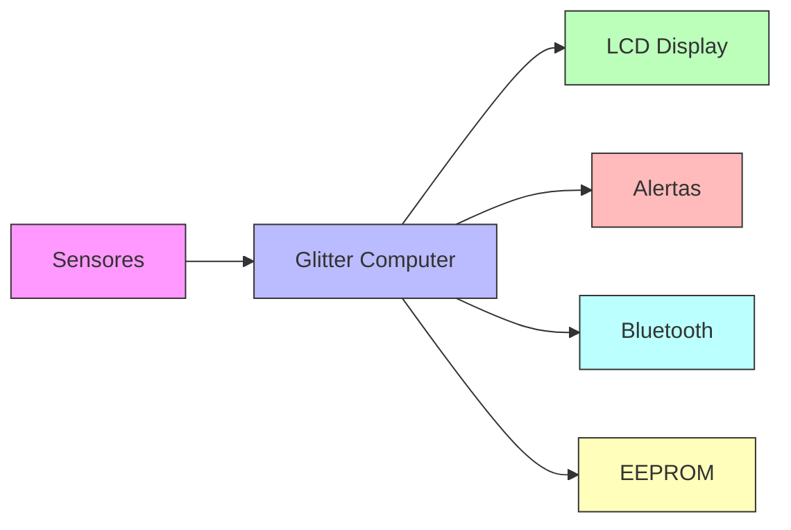
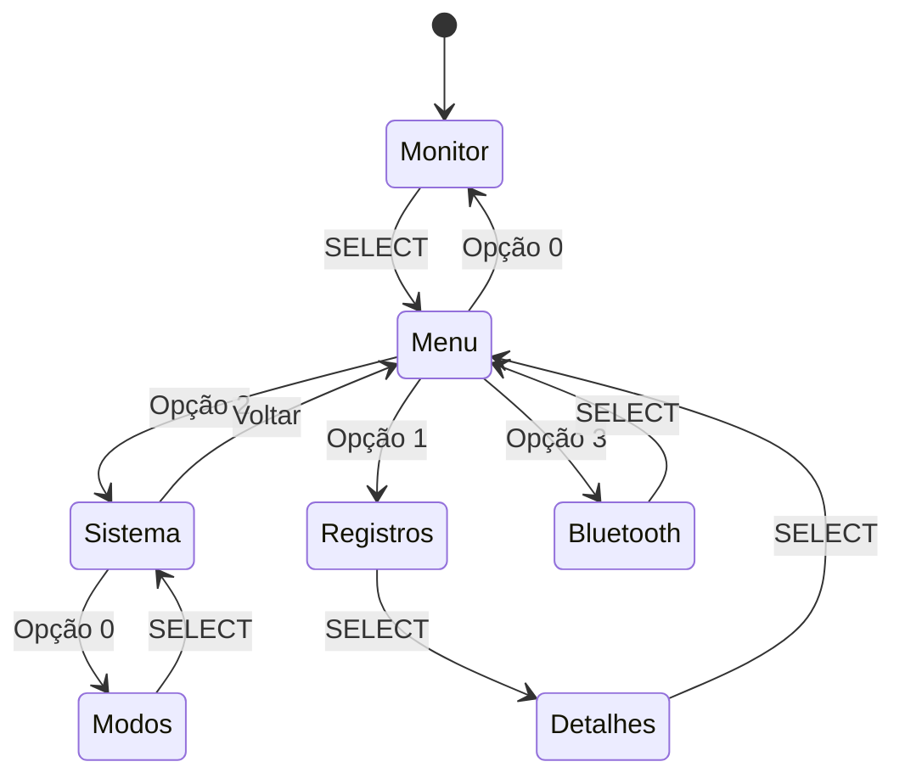
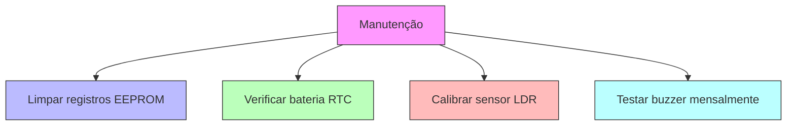

<div align="center">
  
# ✨ GLITTER COMPUTER ✨
### *Sistema Embarcado de Monitoramento Ambiental*


</div>

---

## 📋 Índice
- [Sobre o Projeto](#-sobre-o-projeto)
- [Características](#-características)
- [Hardware](#-hardware)
- [Arquitetura do Software](#-arquitetura-do-software)
- [Modos de Operação](#-modos-de-operação)
- [Interface e Navegação](#-interface-e-navegação)
- [Instalação](#-instalação)
- [Comunicação Bluetooth](#-comunicação-bluetooth)
- [Sistema de Alertas](#-sistema-de-alertas)
- [Troubleshooting](#-troubleshooting)
- [Créditos](#-créditos)

---

## 🎯 Sobre o Projeto

O **Glitter Computer** é um sistema embarcado de alta precisão desenvolvido para monitoramento e controle ambiental. Ideal para estufas, ambientes controlados e automação residencial, o projeto combina sensores de última geração com uma interface intuitiva e recursos avançados de registro de dados.

<div align="center">
  


</div>

---

## ✨ Características

| Recurso | Descrição |
|---------|-----------|
| 🌡️ **Monitoramento** | Temperatura, umidade e luminosidade em tempo real |
| 🎮 **4 Modos** | Desativado, Noturno, Estufa e Ambiente |
| 💾 **Registro de Dados** | 80 eventos com timestamp |
| 📱 **Bluetooth** | Monitoramento remoto via app |
| 🔊 **Áudio Inteligente** | Alertas sonoros e feedback |
| 🚨 **Sistema de Alertas** | LEDs e buzzer para condições críticas |
| 🌍 **Bilíngue** | Português e Inglês |
| 📊 **Histórico** | Visualização de registros salvos |

---

## 🛠️ Hardware

### Componentes e Conexões

<div align="center">

| Componente | Pino | Função | Ícone |
|------------|------|--------|-------|
| **DHT22** | 2 | Temperatura e Umidade | 🌡️ |
| **LDR** | A0 | Luminosidade | 💡 |
| **RTC DS1307** | I2C | Relógio em tempo real | ⏰ |
| **LCD 20x4 I2C** | I2C | Interface visual | 📺 |
| **DFPlayer Mini** | 11(RX), 10(TX) | Áudio | 🔊 |
| **Bluetooth HC-05** | 12(RX), 13(TX) | Comunicação wireless | 📱 |
| **Botão UP** | 3 | Navegação | ⬆️ |
| **Botão DOWN** | 4 | Navegação | ⬇️ |
| **Botão SELECT** | 5 | Confirmação | ✅ |
| **Buzzer** | 8 | Alerta sonoro | 🔔 |
| **LED Verde** | 6 | Status normal | 🟢 |
| **LED Vermelho** | 7 | Alerta ativo | 🔴 |

</div>

### Diagrama de Conexões

```
                    ┌─────────────────────────────────┐
                    │      GLITTER COMPUTER           │
                    │         (Arduino)               │
                    └─────────────────────────────────┘
                                    │
        ┌───────────────────────────┼───────────────────────────┐
        │                           │                           │
    ┌──▼──┐                    ┌───▼────┐                 ┌────▼────┐
    │DHT22│                    │   I2C  │                 │Software│
    │ Pin2│                    │  Bus   │                 │ Serial │
    └─────┘                    └───┬────┘                 └────┬────┘
                                   │                          │
                          ┌────────┼────────┐          ┌──────┼──────┐
                          │        │        │          │      │      │
                       ┌──▼──┐ ┌──▼──┐ ┌──▼──┐    ┌──▼──┐ ┌──▼──┐ ┌──▼──┐
                       │ LCD │ │ RTC │ │     │    │ MP3 │ │ BT  │ │     │
                       │0x27│ │0x68│ │     │    │     │ │HC-05│ │     │
                       └─────┘ └─────┘ └─────┘    └─────┘ └─────┘ └─────┘
```

---

## 🏗️ Arquitetura do Software

### Estrutura de Dados na EEPROM

```cpp
// Layout da memória EEPROM
┌─────────────────────────────────────────────────────────────┐
│ Endereço  │ Tamanho │ Descrição              │ Formato      │
├───────────┼─────────┼────────────────────────┼──────────────┤
│ 0         │ 1 byte  │ Unidade temperatura    │ 0=C / 1=F    │
│ 1         │ 1 byte  │ Modo do sistema        │ 0-3          │
│ 2         │ 1 byte  │ Idioma                 │ 0=PT / 1=EN  │
│ 3         │ 1 byte  │ Áudio ON/OFF           │ 0/1          │
│ 5         │ 1 byte  │ Índice atual registro  │ 0-79         │
│ 20-819    │ 800 bytes│ Registros (80×10)     │ Timestamp+   │
│           │         │                        │ Sensores     │
└───────────┴─────────┴────────────────────────┴──────────────┘
```

### Máquina de Estados

<div align="center">



</div>

---

## 🎮 Modos de Operação

<div align="center">

| Modo | 🌡️ Temperatura | 💧 Umidade | 💡 Luminosidade | 🟢 LED | 🔊 Som | ⏱️ Intervalo |
|:----:|:--------------:|:---------:|:--------------:|:-----:|:-----:|:----------:|
| **Desativado** | - | - | - | ✅ | ❌ | 2 min |
| **Noturno** | 15-25°C | 35-60% | <10% | ✅ | ❌ | 10 min |
| **Estufa** | 22-30°C | 50-80% | <90% | ✅ | ✅ | 5 min |
| **Ambiente** | 16-26°C | 40-70% | <60% | ✅ | ✅ | 2 min |

</div>

### Visualização dos Modos

```cpp
switch(modoSistema) {
    case 0:  // 🟢 DESATIVADO
        // Modo monitoramento passivo
        break;
        
    case 1:  // 🌙 NOTURNO
        // Condições ideais para noite
        break;
        
    case 2:  // 🌱 ESTUFA
        // Ambiente controlado para plantas
        break;
        
    case 3:  // 🏠 AMBIENTE
        // Conforto residencial
        break;
}
```

---

## 🖥️ Interface e Navegação

### Hierarquia de Menus

```
📱 TELA PRINCIPAL (Monitor)
   ├── 🌡️ Temperatura: 25.3°C
   ├── 💧 Umidade: 65%
   └── 💡 Luz: 45%
        └── [SELECT] → Menu

📋 MENU PRINCIPAL
   ├── 1️⃣ Monitor
   ├── 2️⃣ Registros
   ├── 3️⃣ Sistema
   └── 4️⃣ Bluetooth

⚙️ SISTEMA
   ├── Modos do sistema
   ├── Unidade temperatura (°C/°F)
   ├── Idioma (PT/EN)
   ├── Áudio (ON/OFF)
   └── Voltar

📊 REGISTROS
   └── Lista com data/hora
        └── [SELECT] → Detalhes

📱 BLUETOOTH
   ├── Nome: HC-05
   └── Senha: 1234
```

---

## 🔧 Instalação

### 1. Pré-requisitos

```bash
# Bibliotecas necessárias para o Arduino IDE
- Wire.h          # Comunicação I2C
- LiquidCrystal_I2C.h  # Display LCD
- DHT.h           # Sensor DHT22
- EEPROM.h        # Memória não-volátil
- RTClib.h        # Relógio em tempo real
- SoftwareSerial.h # Comunicação serial
- DFRobotDFPlayerMini.h # Módulo MP3
```

### 2. Configuração do Hardware

<details>
<summary>📸 Clique para ver o esquema de montagem</summary>

```
1. Conecte todos os componentes conforme tabela de pinos
2. Verifique as tensões de alimentação (5V para sensores)
3. Confirme as conexões I2C (SDA/SCL)
4. Insira o cartão SD com arquivos MP3 no DFPlayer
5. Conecte a bateria do RTC (se necessário)
```
</details>

### 3. Upload do Código

```bash
1. Abra o arquivo .ino no Arduino IDE
2. Selecione a placa: Arduino Uno/Nano
3. Configure a porta COM correta
4. Compile e faça upload
```

---

## 📱 Comunicação Bluetooth

### Comandos Disponíveis

| Comando | Ação |
|:-------:|------|
| **D** | Envia dados dos sensores |
| **0** | Modo Desativado |
| **1** | Modo Noturno |
| **2** | Modo Estufa |
| **3** | Modo Ambiente |

### Formato de Dados

```json
// Exemplo de resposta ao comando 'D'
{
  "temperatura": "25.3°C",
  "umidade": "65%",
  "luminosidade": "45%",
  "status": "normal"
}
```

### Conexão via App

```
📱 Passo a passo:
1. Ative o Bluetooth do dispositivo
2. Procure por "HC-05"
3. Senha: 1234
4. Conecte-se via terminal serial
5. Envie comandos para interagir
```

---

## 🚨 Sistema de Alertas

### Condições de Alerta

```cpp
// Alerta é ativado quando:
❌ Temperatura fora dos limites (min/max)
❌ Umidade fora dos limites (min/max)
❌ Luminosidade acima do máximo permitido
```

### Feedback Visual e Sonoro

<div align="center">

| Condição | LED Verde | LED Vermelho | Buzzer |
|----------|:---------:|:------------:|:------:|
| **Normal** | 🟢 ON | 🔴 OFF | 🔇 |
| **Alerta** | 🟢 OFF | 🔴 Piscando | 🔊 A cada 10s |

</div>

### Registro de Alertas

```cpp
// O sistema salva automaticamente quando:
✅ Um alerta é detectado
✅ Intervalo de tempo configurado é atingido
```

---

## 🔍 Troubleshooting

### Problemas Comuns e Soluções

<details>
<summary>📺 Display LCD não liga</summary>

- Verifique o endereço I2C (0x27 ou 0x3F)
- Confirme as conexões SDA (A4) e SCL (A5)
- Ajuste o contraste com o potenciômetro
</details>

<details>
<summary>🌡️ DHT22 não lê dados</summary>

- Adicione resistor pull-up de 10kΩ
- Aguarde 2 segundos entre leituras
- Verifique a alimentação do sensor
</details>

<details>
<summary>🔊 DFPlayer não reproduz áudio</summary>

- Formate o cartão SD em FAT16/FAT32
- Nomeie os arquivos como 0001.mp3, 0002.mp3, etc.
- Verifique o volume (padrão 25)
</details>

<details>
<summary>📱 Bluetooth não conecta</summary>

- Senha padrão: 1234
- Nome do dispositivo: HC-05
- Verifique baud rate (9600)
</details>

### Manutenção Preventiva



---

## 📊 Especificações Técnicas

### Consumo de Recursos

```cpp
┌──────────────────────┬────────────┬─────────────┐
│ Recurso              │ Utilizado  │ Disponível  │
├──────────────────────┼────────────┼─────────────┤
│ Memória Flash        │ ~12 KB     │ 32 KB (37%) │
│ SRAM                 │ ~500 B     │ 2 KB (24%)  │
│ EEPROM               │ 820 B      │ 1 KB (80%)  │
│ Tempo de Loop        │ <100 ms    │ -           │
│ Leitura DHT22        │ 2 s        │ -           │
└──────────────────────┴────────────┴─────────────┘
```

### Tempos de Resposta

| Operação | Tempo |
|----------|-------|
| Leitura sensores | 2 segundos |
| Atualização LCD | 100 ms |
| Alerta sonoro | <100 ms |
| Salvamento EEPROM | 3.3 ms |
| Resposta Bluetooth | <50 ms |

---

## 🚀 Expansões Futuras

- [ ] **WiFi** com ESP8266 para IoT
- [ ] **Dashboard Web** com gráficos em tempo real
- [ ] **Machine Learning** para previsão de condições
- [ ] **Controle Remoto** de atuadores (irrigação, iluminação)
- [ ] **Notificações** via Telegram/WhatsApp
- [ ] **Sensor de CO₂** para monitoramento de qualidade do ar
- [ ] **SD Card** para maior capacidade de registro

---

## 👥 Créditos

<div align="center">

### Grupo Glitter Computer

| Membro |
|--------|
| **[Ana Lara Dellacorte Simões]** |
| **[Eláine Gomes Moreira]** | 
| **[Joyce da Costa Peres]** |
| **[Rayssa Alves André]** | 

</div>

---


<div align="center">
  
**✨ Desenvolvido com ❤️ para o futuro da automação ✨**

[⬆ Voltar ao topo](#-glitter-computer-)

</div>

